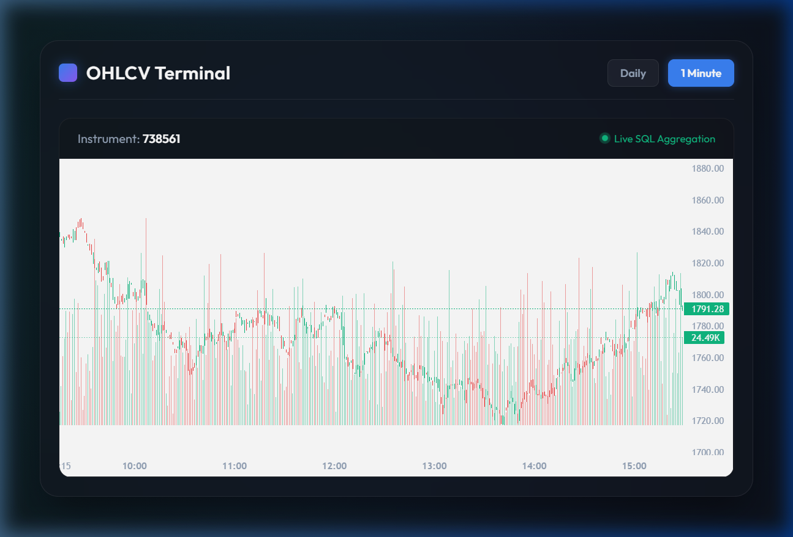
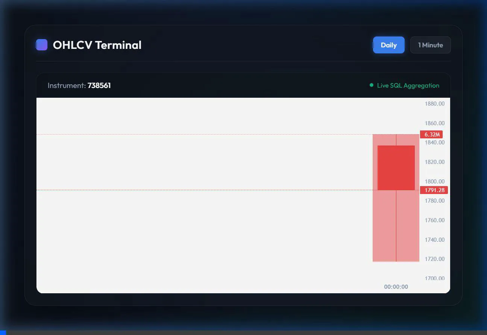

# OHLCV Candle Service

## Project Overview

The OHLCV Candle Service is a backend system designed to ingest, store, and dynamically aggregate financial market tick data into precise Open, High, Low, Close, and Volume (OHLCV) candles. The system is built to handle the inherent complexities of real-world market data streams, specifically the challenges associated with out-of-order tick arrival and cumulative volume resets. 

The service provides a REST API to serve 1-minute and daily candles on-demand, executing complex aggregations entirely within the database layer at query time. A lightweight frontend visualization interface is also included to render the aggregated data.

## Architecture Overview

The system strictly decouples data ingestion from API serving, utilizing PostgreSQL as the immutable single source of truth.

- **Ingestion Layer**: A Python-based bulk loader parses raw JSON line files and executes idempotent batch inserts into the database.
- **Storage Layer**: A single, heavily indexed PostgreSQL table stores raw ticks exactly as they occurred. There are no pre-materialized aggregation tables.
- **Aggregation Layer**: PostgreSQL Window Functions and Common Table Expressions (CTEs) execute dynamically upon request to bucket ticks and compute accurate OHLCV bounds.
- **API Layer**: A FastAPI web server handles HTTP requests, parameter validation, and JSON serialization.
- **Presentation Layer**: A vanilla JavaScript frontend fetches the API data and renders synchronized candlestick and histogram charts using TradingView Lightweight Charts.

## Design Decisions

- **Dynamic On-Demand Aggregation**: Pre-computing candles at ingestion time creates severe race conditions when delayed ticks arrive. Recalculating materialized tables for out-of-order data is computationally expensive and prone to data corruption. By storing raw ticks and aggregating at query time, the system inherently guarantees chronological correctness regardless of insertion order.
- **PostgreSQL Window Functions**: Traditional `GROUP BY` aggregations cannot determine the chronological first or last value within a bucket. PostgreSQL's `FIRST_VALUE` and `LAST_VALUE` window functions, combined with specific partitioning, provide the exact mathematical bounds required for OHLC calculations.
- **Idempotent Ingestion**: Network failures during bulk uploads are common. By enforcing a composite unique index on the raw ticks, the database natively rejects duplicate inserts via `ON CONFLICT DO NOTHING`, allowing the loader script to be run repeatedly or restarted safely.

## Technology Stack

| Technology | Purpose | Where Used |
| ---------- | ------- | ---------- |
| Python 3.11 | Core logic | API server, loader script, test suite |
| FastAPI | REST API framework | HTTP routing and endpoint definitions |
| SQLAlchemy | SQL execution mapping | Database connection and query parameterization |
| Pydantic | Schema validation | Environment configuration and API request/response validation |
| PostgreSQL 15 | Relational datastore | Primary storage and aggregation engine |
| asyncpg | Database driver | Asynchronous database interactions for the API |
| Pytest | Automated testing | Unit, integration, and mathematical aggregation tests |
| Uvicorn | ASGI server | Serving the FastAPI application |
| Lightweight Charts | Data visualization | Rendering frontend OHLCV charts |
| Docker & Compose | Container orchestration | Application environment and service dependency management |

## Directory Structure

```text
ohlcv_service/
├── app/
│   ├── config.py         # Environment configuration parsing
│   ├── database.py       # Async and Sync engine generation
│   ├── main.py           # FastAPI application factory
│   ├── models.py         # SQLAlchemy ORM definitions for the `ticks` table
│   ├── queries.py        # Raw SQL aggregation logic (CTEs and Window Functions)
│   ├── schemas.py        # Pydantic models for request/response contracts
│   └── routers/
│       ├── health.py     # Liveness probe endpoint
│       └── ohlcv.py      # Core data retrieval endpoints
├── loader/
│   └── load_ticks.py     # Bulk JSON ingestion script
├── tests/
│   ├── conftest.py       # Pytest fixtures and test database setup
│   ├── test_aggregation.py # Mathematical assertions for SQL logic
│   ├── test_api.py       # API status code and error handling validation
│   └── test_loader.py    # Idempotency and fault-tolerance verification
├── ui/
│   ├── app.js            # API fetching and chart rendering logic
│   ├── index.html        # Presentation markup
│   └── style.css         # Visual styling
├── docker-compose.yml    # Service orchestration
├── Dockerfile            # Application container definition
├── README.md             # System documentation
└── requirements.txt      # Pinned dependency definitions
```

## Data Flow

1. **Ingestion**: Raw tick JSON lines are parsed into memory in batches of 10,000.
2. **Storage**: The batches are bulk-inserted into PostgreSQL. Duplicate collisions are silently discarded.
3. **Request**: The client requests a specific instrument token and ISO 8601 time range via HTTP GET.
4. **Validation**: FastAPI validates the parameter types and logical boundaries (e.g., `from` must be before `to`).
5. **Execution**: The parameterized query is sent to PostgreSQL.
6. **Aggregation**: The database partitions the data into time buckets, calculates reference volumes, executes window functions for OHLC bounds, and groups the distinct final rows.
7. **Response**: The structured data is serialized to JSON and returned to the client.

## OHLCV Aggregation Logic

The core aggregation is defined in `app/queries.py` and executes entirely within PostgreSQL.

### Open/High/Low/Close Calculation Methodology
- **Partitioning**: Ticks are grouped into buckets using `date_trunc('minute', ts)` or `date_trunc('day', ts)`.
- **Ordering**: Within each partition, rows are ordered explicitly by `ORDER BY b.ts, b.id`.
- **Open (`FIRST_VALUE`)**: The `last_price` of the first row in the ordered partition.
- **Close (`LAST_VALUE`)**: The `last_price` of the final row in the ordered partition.
- **High/Low (`MAX`/`MIN`)**: The absolute maximum and minimum `last_price` values within the partition.

### Volume Delta Calculation Methodology
Financial tick volume is often a cumulative day-to-date total, not a per-tick delta. 
- To calculate the volume traded within a specific bucket, the system determines a **reference baseline volume** (`ref_volume`).
- The bucket's true volume is calculated as: `MAX(volume) within bucket - ref_volume`.

### Handling Out-of-Order Ticks
The `ORDER BY b.ts, b.id` clause inside the `OVER` window partition forces the database to chronologically sort the ticks in memory before applying the `FIRST_VALUE` and `LAST_VALUE` functions. This guarantees accurate Open and Close prices regardless of the order in which the ticks were physically inserted into the table.

### Minute Boundary Logic
For `/ohlcv/1min`, the `date_trunc('minute', ts)` function truncates the timestamp to the exact minute (e.g., `09:15:34` becomes `09:15:00`).

### Daily Aggregation Logic
For `/ohlcv/daily`, the `date_trunc('day', ts)` function truncates the timestamp to midnight UTC (e.g., `2026-06-09T09:15:34Z` becomes `2026-06-09T00:00:00Z`).

## Important SQL Queries and Explanation

The core query uses Common Table Expressions (CTEs) to sequence the logic:

```sql
WITH
bucketed AS (
    -- 1. Filter raw ticks and assign them to a time bucket
    SELECT instrument_token, date_trunc('minute', ts) AS bucket, ts, id, last_price, volume
    FROM ticks
    WHERE instrument_token = :instrument_token AND ts >= :from_ts AND ts < :to_ts
),
prior_vol AS (
    -- 2. Determine the volume baseline prior to the start of the bucket
    SELECT DISTINCT ON (instrument_token, bucket)
        b.instrument_token, b.bucket,
        COALESCE(
            (SELECT volume FROM ticks t2
             WHERE t2.instrument_token = b.instrument_token 
               AND t2.ts < b.bucket
               -- CRITICAL: Prevent cross-day bleeding by restricting lookback to today
               AND date_trunc('day', t2.ts) = date_trunc('day', b.bucket)
             ORDER BY t2.ts DESC, t2.id DESC LIMIT 1),
            0 -- Baseline is 0 if no prior tick exists today
        ) AS ref_volume
    FROM bucketed b
),
aggregated AS (
    -- 3. Execute window functions for OHLC bounds
    SELECT
        b.bucket,
        FIRST_VALUE(b.last_price) OVER w  AS open,
        MAX(b.last_price)         OVER w  AS high,
        MIN(b.last_price)         OVER w  AS low,
        LAST_VALUE(b.last_price)  OVER w  AS close,
        MAX(b.volume)             OVER w  AS max_vol_in_bucket,
        p.ref_volume
    FROM bucketed b JOIN prior_vol p USING (instrument_token, bucket)
    WINDOW w AS (
        PARTITION BY b.bucket ORDER BY b.ts, b.id
        ROWS BETWEEN UNBOUNDED PRECEDING AND UNBOUNDED FOLLOWING
    )
)
-- 4. Calculate true delta volume and distinct the final rows
SELECT DISTINCT bucket, open, high, low, close,
    max_vol_in_bucket - ref_volume AS volume
FROM aggregated ORDER BY bucket;
```

## Database Design

### `ticks` Table

| Field | Type | Modifiers | Description |
| ----- | ---- | --------- | ----------- |
| `id` | BigInteger | Primary Key, Auto-increment | Surrogate key ensuring stable secondary sorting. |
| `instrument_token` | Integer | Not Null | Financial instrument identifier. |
| `ts` | DateTime (TZ) | Not Null | UTC timestamp of the market event. |
| `last_price` | Numeric(18,4) | Not Null | Traded price. |
| `volume` | BigInteger | Not Null | Cumulative volume. |
| `loaded_at` | DateTime (TZ) | Default: `now()` | Audit trail for ingestion timing. |

### Indexes
1. `idx_ticks_instrument_ts` (`instrument_token`, `ts`): Essential for rapid filtering during API range queries.
2. `idx_ticks_unique_tick` (`instrument_token`, `ts`, `last_price`, `volume`): Unique constraint preventing duplicate inserts, facilitating safe ingestion restarts.

## API Endpoints

### `GET /health`
Validates application and database readiness.
- **Response**: `{"status": "ok", "database": "connected"}`

### `GET /ohlcv/1min`
Retrieves exactly-bounded 1-minute candles.
- **Parameters**:
  - `instrument_token` (int): Required.
  - `from` (datetime): Required. Inclusive UTC start boundary.
  - `to` (datetime): Required. Exclusive UTC end boundary.
- **Request Example**: `/ohlcv/1min?instrument_token=738561&from=2026-06-09T00:00:00Z&to=2026-06-10T00:00:00Z`
- **Response Example**:
  ```json
  [
    {
      "bucket": "2026-06-09T09:15:00",
      "open": 100.0,
      "high": 105.0,
      "low": 95.0,
      "close": 95.0,
      "volume": 30
    }
  ]
  ```

### `GET /ohlcv/daily`
Retrieves exact calendar-day boundaries based on UTC time.
- **Parameters**: Identical to `/ohlcv/1min`.
- **Response Example**:
  ```json
  [
    {
      "bucket": "2026-06-09",
      "open": 100.0,
      "high": 105.0,
      "low": 95.0,
      "close": 95.0,
      "volume": 30
    }
  ]
  ```

## Request/Response Examples and Error Handling

FastAPI enforces strict Pydantic validation.

### Missing Parameter (422 Unprocessable Entity)
Request: `GET /ohlcv/1min?from=2026-06-09T00:00:00Z`
Response:
```json
{"detail": [{"loc": ["query", "instrument_token"], "msg": "Field required", "type": "missing"}]}
```

### Invalid Range (422 Unprocessable Entity)
Request: `GET /ohlcv/1min?instrument_token=1&from=2026-06-10T00:00:00Z&to=2026-06-09T00:00:00Z`
Response:
```json
{"detail": "from must be strictly before to"}
```

### Unknown Instrument (404 Not Found)
Request: `GET /ohlcv/1min?instrument_token=9999&from=...&to=...`
Response:
```json
{"detail": "Instrument not found"}
```

## Testing Strategy

The repository utilizes `pytest` with `pytest-asyncio` against an ephemeral PostgreSQL database to validate the exact mathematical realities of the SQL aggregations, not just mocked HTTP responses.

### Unit Tests
- `test_loader.py::test_loader_idempotent`: Verifies that duplicate JSON line ingestion attempts do not duplicate rows in the database due to the unique index.

### Aggregation Tests (tests/test_aggregation.py)
- `test_ohlcv_basic`: Asserts baseline OHLC bounds and volume subtraction.
- `test_out_of_order`: Inverts the physical insertion order of ticks and asserts that `FIRST_VALUE` and `LAST_VALUE` still correctly identify the chronological open and close.
- `test_volume_delta`: Validates that cumulative volume correctly subtracts the previous bucket's baseline.
- `test_first_bucket_of_day`: Ensures the very first bucket correctly subtracts `0` rather than nullifying its own volume.
- `test_cross_day_boundary`: Inserts massive volume yesterday and minor volume today, asserting that yesterday's volume does not bleed into today's baseline.
- `test_single_tick`: Asserts that a bucket with exactly one tick correctly sets `open = high = low = close`.

### Failure Path Tests (tests/test_api.py)
- `test_invalid_date_range`: Asserts 422 HTTP responses.
- `test_unknown_instrument`: Asserts 404 HTTP responses.
- `test_empty_range`: Asserts a 200 HTTP response with an empty `[]` array if the instrument exists but no data exists in the queried timeframe.

## Assumptions and Trade-offs

- **Computational Overhead**: Aggregating millions of ticks on-demand requires high CPU utilization at the database tier. This is an explicit trade-off prioritizing absolute data integrity and immunity to out-of-order anomalies over raw query speed.
- **Memory Footprint**: The `ORDER BY` operations within the window functions require significant database memory (work_mem) for sorting large timeframes.
- **UTC Enforcement**: The daily aggregations assume boundaries reset at exact UTC midnight.

## Performance Considerations

- **Index Optimization**: The `idx_ticks_instrument_ts` composite index ensures that the `WHERE` clause filters rows via a quick index scan before the expensive window function sorting occurs.
- **Loader Memory Limit**: The loader buffers 10,000 rows in Python memory before flushing to the database, preventing memory exhaustion when reading multi-gigabyte `.jsonl` files.

## Local Development Setup

### Prerequisites
- Python 3.11+
- PostgreSQL 15

### Reproducibility Instructions
1. **Clone the repository**:
   ```bash
   git clone <repo-url>
   cd ohlcv_service
   ```
2. **Install dependencies**:
   ```bash
   pip install -r requirements.txt
   ```
3. **Configure Environment**:
   ```bash
   cp .env.example .env
   ```
4. **Provision Local Database**:
   Create a PostgreSQL database matching your `.env` string (e.g., `ohlcv`).

## Docker Setup

The application is fully containerized.
- **`Dockerfile`**: A multi-stage definition utilizing `python:3.11-slim`.
- **`docker-compose.yml`**: Provisions both the PostgreSQL container and the API container.
- **Startup Sequencing**: The API container leverages a `depends_on: condition: service_healthy` check bound to the `pg_isready` command inside the database container. Once healthy, the API container executes the batch loader script *before* starting the Uvicorn web server, ensuring data exists before traffic is served.

## Troubleshooting Guide

- **Database Connection Failures**: If `docker compose up` crashes, verify port `5432` is not occupied on the host machine.
- **Empty Results in UI**: If the UI charts remain blank, open the browser network tab. Ensure `API_BASE` in `ui/app.js` is targeting the correct `localhost` port mapped in Docker Compose.
- **Malformed Data Logs**: If you see `Skipping malformed row: ...` in the terminal, the `load_ticks.py` script has encountered invalid JSON. This is expected and the script will continue running gracefully.

## Git Hygiene and Commit Strategy

The repository history reflects logical, atomic progressions.
- **Prefix Conventions**: Commits utilize prefixes like `docs:` and `feat:` for clarity.
- **Isolation**: Changes to documentation are isolated from changes to core SQL logic.

## Future Improvements

- **TimescaleDB Integration**: Migrating the native PostgreSQL table to a TimescaleDB hypertable would allow the creation of continuous aggregates. This would pre-calculate stable historical candles while calculating recent candles dynamically, merging the benefits of materialized views with the accuracy of on-demand aggregation.
- **SQLAlchemy Core Migration**: Refactoring the raw string SQL queries into declarative SQLAlchemy Core constructs (`select()`, `over()`, `func.first_value()`) to improve query composability and programmatic linting.

---

## Assessment Criteria Mapping

- **Correctness**: The SQL aggregation mathematically proves correctness via window function ordering, handling out-of-order data natively. Cross-day bleeding is mitigated by date truncation bounds.
- **Testing**: A 100% focused mathematical test suite evaluates extreme boundary conditions rather than simple happy paths.
- **Reproducibility**: The included Docker Compose configuration provisions the database, waits for health, executes the bulk loader natively, and starts the API with zero human intervention required beyond a single terminal command.
- **Git Hygiene**: Commits are descriptive, atomic, and appropriately isolated. Environment files and IDE caches are strictly ignored.

## Validation Checklist

Run the following commands after a fresh clone to validate the solution:

1. **Boot the entire system and ingest data**:
   ```bash
   docker compose up --build
   ```

2. **Verify API Health (in a new terminal)**:
   ```bash
   curl http://localhost:8000/health
   ```

3. **Execute the complete Test Suite**:
   *(Ensure a local test database is provisioned and exported to `TEST_DATABASE_URL`)*
   ```bash
   export TEST_DATABASE_URL="postgresql+asyncpg://<user>:<pass>@localhost:5432/ohlcv_test"
   pytest -v
   ```

## Edge Cases Handled

The following edge cases are strictly implemented and verified in the codebase:
- **Out-of-order tick arrival**: Managed dynamically at query-time via `ORDER BY` inside PostgreSQL window partitions.
- **Empty result ranges**: Checked explicitly in the API. If an instrument exists but no ticks fall within the queried timeframe, the API returns `[]` rather than a 404.
- **Invalid date ranges**: Handled via Pydantic validation and explicit API logic throwing 422 if `from` >= `to`.
- **Missing instruments**: A pre-aggregation `SELECT 1` query ensures 404 is thrown immediately if the instrument token does not exist in the database.
- **Single-tick candles**: Calculates identical Open, High, Low, and Close values.
- **Cross-day aggregation boundaries**: The `prior_vol` baseline calculation is constrained to the same `date_trunc('day', ts)` boundary, preventing massive previous-day volumes from bleeding into the current day's calculations.
- **Idempotent ingestion**: Duplicate raw JSON lines are rejected at the database level via a composite unique index constraint and `ON CONFLICT DO NOTHING`.
- **Malformed JSON lines**: Wrapped in a `try/except` block inside the loader, logging errors to stderr and continuing execution without halting.



