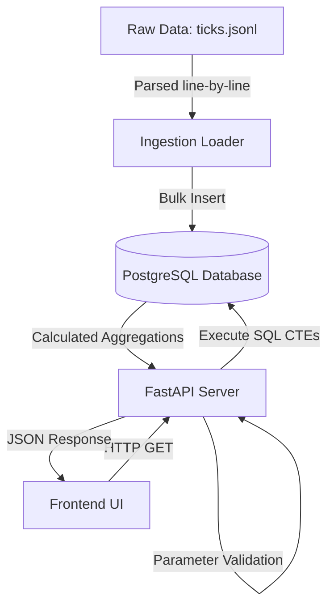
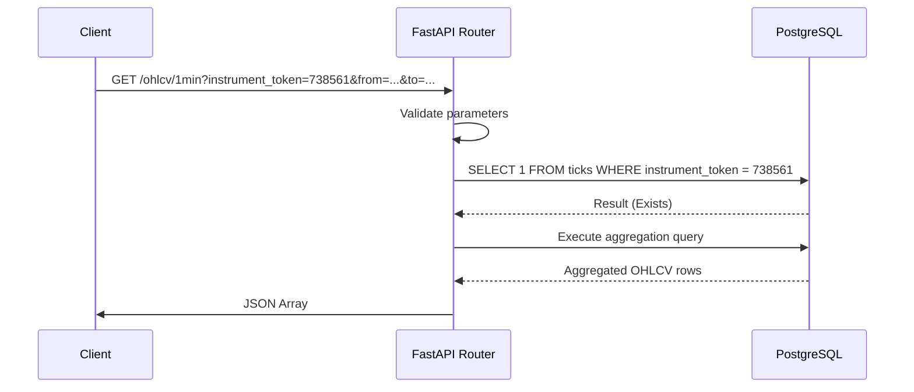
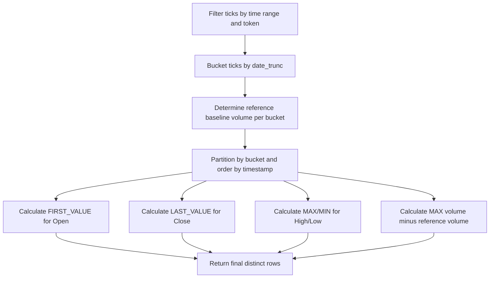
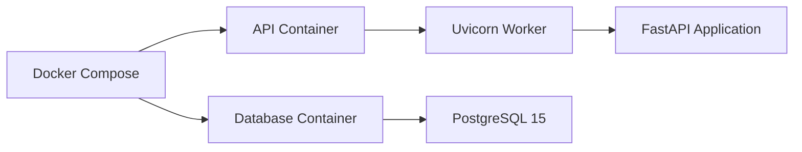

# OHLCV Candle Service

The OHLCV Candle Service is a production-grade backend and visualization system designed to ingest, aggregate, and display financial market tick data.

## Executive Summary

The application ingests high-volume, potentially out-of-order financial tick streams and serves dynamically calculated Open, High, Low, Close, and Volume (OHLCV) candles via a REST API. It exists to solve the complexities of financial data aggregation, specifically the challenges associated with out-of-order tick arrival and cumulative volume resets. 

The primary target users are quantitative researchers, trading system developers, and data engineers who require mathematically perfect historical data without the overhead of maintaining fragile, materialized aggregation tables. The primary technical challenge involves calculating true volume deltas from cumulative streams and maintaining accurate OHLC bounds exclusively at query time.

## System Overview

The system operates across several distinct layers:
- **Tick Ingestion**: A resilient bulk loader reads JSON lines from a raw data file and inserts them into the database using idempotent batch operations.
- **Storage**: A single PostgreSQL table stores raw, unaggregated ticks. 
- **Aggregation**: Complex PostgreSQL Window Functions and Common Table Expressions (CTEs) execute at query time to group raw ticks into time buckets and calculate OHLCV.
- **API Layer**: A FastAPI server exposes HTTP endpoints for querying 1-minute and daily candles, acting as a secure interface to the database aggregation engine.
- **Visualization Layer**: A vanilla JavaScript frontend utilizes TradingView Lightweight Charts to render the aggregated data directly in the browser.

## Real World Context

In real-world financial markets, tick data represents individual trades. These ticks are often transmitted with cumulative volume metrics representing the total shares traded since the market opened, rather than the volume of that specific trade. Furthermore, due to network latency and distributed exchange architectures, ticks routinely arrive out of chronological order.

This implementation stores raw ticks exactly as they arrive. By deferring aggregation to the time of query, the system dynamically reconstructs chronological order using SQL window functions, guaranteeing that the `open` price is always the earliest chronological tick and the `close` is the latest, regardless of the physical row insertion order. It also calculates true bucket volume by subtracting the previously known cumulative volume from the maximum cumulative volume within the bucket.

## Architecture

### High-Level Architecture



This diagram illustrates the separation of ingestion from consumption. The loader populates the database independently of the FastAPI server, which services frontend requests.

### Request Flow



The request flow ensures that the system fails fast if an unknown instrument token is requested, preventing the database from executing heavy window functions unnecessarily.

### Aggregation Flow



The aggregation flow isolates the complex data transformations occurring within PostgreSQL.

### Deployment Architecture



The deployment is managed entirely through Docker Compose, which handles the networking and startup sequencing between the database and the API.

## Repository Structure

```text
ohlcv_service/
├── app/
│   ├── config.py         
│   ├── database.py       
│   ├── main.py           
│   ├── models.py         
│   ├── queries.py        
│   ├── schemas.py        
│   └── routers/
│       ├── health.py     
│       └── ohlcv.py      
├── loader/
│   └── load_ticks.py     
├── tests/
│   ├── conftest.py       
│   ├── test_aggregation.py 
│   ├── test_api.py       
│   └── test_loader.py    
├── ui/
│   ├── app.js            
│   ├── index.html        
│   └── style.css         
├── docker-compose.yml    
├── Dockerfile            
├── README.md             
└── requirements.txt      
```

### `app/`
Contains the core FastAPI web server implementation.
- **`config.py`**: Parses environment variables and provides typed configuration settings.
- **`database.py`**: Configures the SQLAlchemy async engine for the API and the sync engine for initial setup.
- **`main.py`**: The FastAPI application factory, routing inclusion, and startup lifespan context.
- **`models.py`**: SQLAlchemy ORM definitions mapping to the database schema.
- **`queries.py`**: Contains the raw SQL aggregation logic using CTEs and Window Functions.
- **`schemas.py`**: Pydantic models for enforcing API request and response contracts.
- **`routers/`**: Contains the route handlers for health checks and OHLCV data retrieval.

### `loader/`
Contains data ingestion scripts.
- **`load_ticks.py`**: A standalone CLI application that parses JSON lines and executes bulk database inserts.

### `tests/`
Contains the pytest suite.
- **`conftest.py`**: Provides fixtures for spinning up ephemeral test databases and configuring async HTTP clients.
- **`test_aggregation.py`**: Validates the mathematical correctness of the SQL logic.
- **`test_api.py`**: Validates HTTP status codes and error handling.
- **`test_loader.py`**: Validates ingestion idempotency.

### `ui/`
Contains the frontend visualization interface.
- **`index.html`**: The main HTML document containing layout and chart container definitions.
- **`app.js`**: Fetches API data and renders TradingView Lightweight Charts.
- **`style.css`**: Styling definitions for the dashboard.


## Technology Stack

| Technology | Purpose | Where Used |
| ---------- | ------- | ---------- |
| Python 3.11 | Core programming language | `app/`, `loader/`, `tests/` |
| FastAPI | HTTP web server framework | `app/main.py`, `app/routers/` |
| SQLAlchemy | Database ORM and session management | `app/database.py`, `app/models.py` |
| PostgreSQL 15 | Relational datastore | `docker-compose.yml` |
| asyncpg | Asynchronous PostgreSQL driver | `app/database.py` |
| Pydantic | Data validation and settings management | `app/schemas.py`, `app/config.py` |
| Pytest | Automated testing framework | `tests/` |
| Uvicorn | ASGI web server implementation | `Dockerfile`, `docker-compose.yml` |
| Lightweight Charts | Frontend candlestick and histogram rendering | `ui/app.js` |
| Docker & Compose | Container orchestration | `Dockerfile`, `docker-compose.yml` |

## Database Design

The system utilizes a single table to store raw market ticks.

### `ticks` Table

| Field | Type | Description |
| ----- | ---- | ----------- |
| `id` | BigInteger | Primary key, auto-incrementing. |
| `instrument_token` | Integer | Identifier for the financial instrument. |
| `ts` | DateTime (TZ) | Timestamp of the tick. |
| `last_price` | Numeric(18, 4) | The price at which the trade occurred. |
| `volume` | BigInteger | Cumulative volume of the instrument for the day. |
| `loaded_at` | DateTime (TZ) | System timestamp of insertion. |

### Constraints & Indexes
- **Primary Key**: `id`
- **Unique Constraint (`idx_ticks_unique_tick`)**: Spans `instrument_token`, `ts`, `last_price`, and `volume`. This ensures that identical ticks cannot be inserted twice, enabling the loader to run idempotently.
- **Index (`idx_ticks_instrument_ts`)**: Spans `instrument_token` and `ts`. This heavily optimizes the `WHERE` clauses used during API retrieval.

This schema supports the problem requirements by maintaining an immutable ledger of market activity. By avoiding aggregate tables, the system is immune to data corruption caused by delayed or out-of-order ticks.

## Aggregation Engine

The aggregation engine is implemented entirely in raw SQL within `app/queries.py`.

### Query Flow
1. **`bucketed` CTE**: Filters raw ticks by `instrument_token` and time boundaries, assigning each tick to a time bucket using `date_trunc`.
2. **`prior_vol` CTE**: Calculates the baseline volume for each bucket. It looks for the most recent tick from the *same trading day* prior to the bucket's start time. If no prior tick exists today, the baseline is explicitly set to `0`.
3. **`aggregated` CTE**: Applies window functions across the partitioned buckets.
   - `FIRST_VALUE(b.last_price)` determines the Open price by ordering by timestamp.
   - `LAST_VALUE(b.last_price)` determines the Close price.
   - `MAX` and `MIN` determine the High and Low prices.
4. **Final Select**: Subtracts the reference volume baseline from the maximum volume within the bucket to determine the true volume delta.

### Handling Out-of-Order Ticks
Because the window functions `PARTITION BY b.bucket ORDER BY b.ts, b.id`, the database dynamically sorts the rows in memory before applying `FIRST_VALUE` and `LAST_VALUE`. This guarantees that chronological boundaries are respected regardless of the physical `id` sequence.

### Handling Volume Derivation
Cumulative volume resets daily. The `prior_vol` CTE ensures that the baseline lookup includes the clause `date_trunc('day', t2.ts) = date_trunc('day', b.bucket)`. This prevents cross-day bleed, where millions of shares traded yesterday would otherwise subtract from today's volume, causing negative values. 

## API Documentation

### GET /ohlcv/1min

Retrieves 1-minute bucketed OHLCV data.

- **Purpose**: Provides high-resolution candle data for intraday analysis.
- **Parameters**:
  - `instrument_token` (int): Required. The identifier of the instrument.
  - `from` (datetime): Required. Inclusive start boundary (ISO 8601).
  - `to` (datetime): Required. Exclusive end boundary (ISO 8601).
- **Validation Rules**: `from` must be chronologically before `to`.
- **Request Example**: `GET /ohlcv/1min?instrument_token=738561&from=2026-06-09T00:00:00Z&to=2026-06-10T00:00:00Z`
- **Response Example**:
  ```json
  [
    {
      "bucket": "2026-06-09T09:15:00",
      "open": 100.0,
      "high": 105.0,
      "low": 95.0,
      "close": 95.0,
      "volume": 30
    }
  ]
  ```
- **Error Responses**:
  - `404 Not Found`: Returned if no ticks exist for the given `instrument_token`.
  - `422 Unprocessable Entity`: Returned if `from` is greater than or equal to `to`, or if parameters are missing.

### GET /ohlcv/daily

Retrieves daily bucketed OHLCV data.

- **Purpose**: Provides low-resolution candle data for macro analysis.
- **Parameters**: Identical to `/ohlcv/1min`.
- **Response Example**:
  ```json
  [
    {
      "bucket": "2026-06-09",
      "open": 100.0,
      "high": 200.0,
      "low": 100.0,
      "close": 200.0,
      "volume": 40
    }
  ]
  ```

### GET /health

Retrieves application health status.

- **Purpose**: Readiness probe for orchestration systems.
- **Response Example**: `{"status": "ok", "database": "connected"}`
- **Error Responses**:
  - `503 Service Unavailable`: Returned if the database execution fails.

## Frontend

The repository includes a lightweight frontend located in the `ui/` directory.

- **User Interface Architecture**: Vanilla HTML/CSS/JS without compilation steps or frameworks.
- **State Management**: Minimal local state tracking the current active chart series.
- **API Communication**: Utilizes the native `fetch` API to retrieve data from the backend.
- **Chart Rendering**: Implements TradingView Lightweight Charts, rendering synchronized candlestick (`candleSeries`) and histogram (`volumeSeries`) layers.
- **User Workflow**: Users toggle between Daily and 1 Minute resolutions via header buttons, which trigger a re-fetch and re-render of the chart data.

## End-to-End Workflow

1. **Data Loading**: The `loader/load_ticks.py` script reads `ticks.jsonl`, buffers records, and commits them to PostgreSQL.
2. **User Makes a Request**: The user opens the frontend (`index.html`). The JavaScript executes a `fetch` request to the FastAPI `/ohlcv/daily` endpoint.
3. **Aggregation Executes**: FastAPI validates the request parameters and passes them to the parameterized SQL query. PostgreSQL partitions the data, determines bounding values, and returns the aggregated rows.
4. **Results are Returned**: FastAPI serializes the SQL result set into JSON schemas and transmits it back to the frontend, which renders the candlesticks and volume bars on the canvas.

## Testing Strategy

The repository utilizes `pytest` with `pytest-asyncio` for asynchronous execution.

- **Aggregation Tests (`test_aggregation.py`)**: Asserts mathematical correctness. Tests validate 1-minute basic aggregation, out-of-order tick handling, volume delta calculations, first-bucket baseline handling, single-tick scenarios, cross-day volume bleeding, and daily resolution grouping.
- **API Tests (`test_api.py`)**: Asserts HTTP protocol adherence. Validates 404 handling for unknown instruments, 422 handling for invalid date ranges, empty array responses for valid dates with no data, and 200 health check successes.
- **Loader Tests (`test_loader.py`)**: Asserts the idempotency of the ingestion script by loading a mock file multiple times and verifying the database count does not increase.

## Local Development Setup

### Fresh Machine Setup
Ensure Python 3.11+ and PostgreSQL 15 are installed.

### Dependency Installation
```bash
pip install -r requirements.txt
```

### Environment Configuration
Copy the environment template:
```bash
cp .env.example .env
```

### Database Setup
Create a local PostgreSQL database named `ohlcv`. Ensure the credentials match your `.env` configuration.

### Data Loading
Ensure a file named `ticks.jsonl` exists in the repository root. Run the loader:
```bash
python -m loader.load_ticks
```

### Running Tests
Export the test database URL and execute pytest:
```bash
export TEST_DATABASE_URL="postgresql+asyncpg://<user>:<pass>@localhost:5432/<test_db>"
pytest -v
```

### Running the Application
Start the Uvicorn ASGI server:
```bash
uvicorn app.main:app --host 0.0.0.0 --port 8000
```
To view the UI, open `ui/index.html` in a web browser.

## Docker Deployment

The application is fully containerized.

- **Dockerfile**: Builds a lean `python:3.11-slim` image, installing dependencies and copying the application source.
- **Docker Compose**: Orchestrates the API and Database services.
- **Service Dependencies**: The `api` service relies on the `db` service. It utilizes a `pg_isready` healthcheck to ensure the database is fully initialized before the API container begins execution.
- **Startup Sequence**: The API container runs a composite command: `sh -c "python -m loader.load_ticks && uvicorn app.main:app --host 0.0.0.0 --port 8000"`. This ensures data is loaded before the web server binds to the port.

## Configuration

Configuration is managed via `app/config.py` using Pydantic Settings.

| Environment Variable | Default Value | Required | Purpose |
| -------------------- | ------------- | -------- | ------- |
| `DATABASE_URL` | None | Yes | Asyncpg connection string for API operations. |
| `SYNC_DATABASE_URL` | None | Yes | Psycopg2 connection string for schema generation and loader script. |
| `TICKS_FILE` | None | Yes | Absolute or relative path to the `.jsonl` data file. |
| `API_HOST` | `0.0.0.0` | No | Host address for Uvicorn binding. |
| `API_PORT` | `8000` | No | Port for Uvicorn binding. |

## Design Decisions

- **Why this architecture was chosen**: The strict separation of data ingestion and API serving prevents high-throughput inserts from blocking HTTP request event loops.
- **Why PostgreSQL was chosen**: PostgreSQL provides advanced Window Functions (`FIRST_VALUE`, `LAST_VALUE`) and `DISTINCT ON` capabilities which are strictly required to calculate OHLCV bounds without materialized views.
- **Why this aggregation strategy was chosen**: By aggregating on-demand rather than upon ingestion, the system completely avoids data corruption caused by out-of-order tick arrival. Re-calculating an entire candle table for a delayed tick is computationally expensive; window functions solve this inherently.

## Performance Considerations

- **Query Efficiency**: The composite index on `(instrument_token, ts)` ensures that the database only scans relevant rows before partitioning them for window functions.
- **Known Limitations**: On-demand aggregation requires high CPU utilization during query execution. Extremely large date ranges (e.g., pulling 1-minute candles spanning multiple years) will result in longer response times compared to querying a pre-materialized table.

## Troubleshooting

- **Database connection failures**: If the API throws a 503 on the `/health` endpoint, verify that the `DATABASE_URL` uses the correct `postgresql+asyncpg://` schema and the database port is accessible.
- **Empty results**: If the API returns `[]`, verify that the `instrument_token` exists and the `from` and `to` timestamps accurately encapsulate the data in `ticks.jsonl`.
- **Docker startup issues**: If the API container exits immediately, check the logs. It will exit with code 1 if the `TICKS_FILE` cannot be located by the loader script.
- **Missing UI Data**: If the frontend chart remains blank, ensure the `API_BASE` constant in `ui/app.js` matches the port where Uvicorn is running.

## Future Improvements

- Implementation of continuous aggregates utilizing TimescaleDB to offset CPU load for macro-level timeframes while maintaining real-time accuracy for recent data.
- Refactoring the raw SQL strings in `app/queries.py` into programmatic SQLAlchemy Core constructs to improve modularity and programmatic reuse.

## Conclusion

The OHLCV Candle Service provides a highly accurate, mathematically rigorous solution for financial data aggregation. By leveraging raw PostgreSQL Window Functions over raw tick data, it circumvents the traditional pitfalls of materialized candle generation, offering a resilient architecture capable of handling the inherent chaos of live market data streams.
